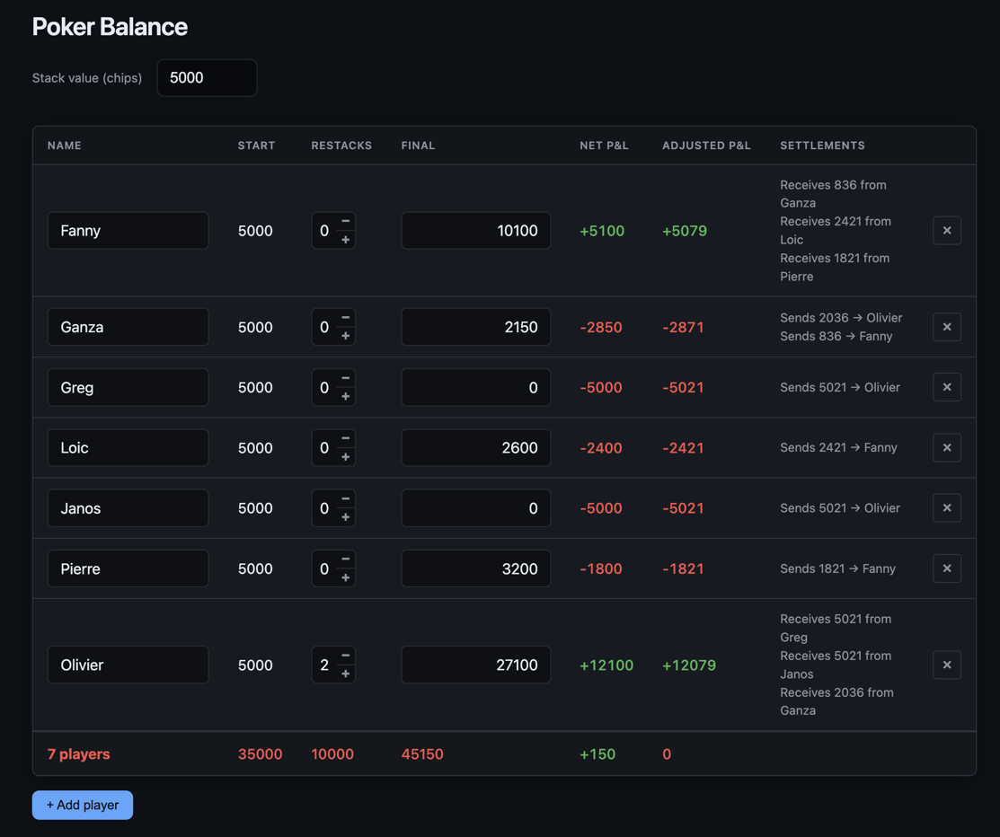

# Poker Balance

A single-page web app to compute poker game results and optimal settlements that minimize the number of transfers between players.



## Features

- Player grid: name, start balance, restacks, final chip balance
- Net P&L: `final - start - (restacks × stack value)`
- Optimal settlements: minimal number of transfers to settle all debts
- Configurable stack value (chips)
- LocalStorage persistence
- Dark theme, responsive layout

## Setup

```bash
npm install
npm test
npm run lint
```

## Usage

Open `index.html` in a browser, or serve the directory (e.g. `npx serve .`). Configure the stack value, add/remove players, and edit restacks and final balance. Settlements update automatically.

## Deployment (GitHub Pages)

1. Push to `main` or `master`.
2. In the repo: **Settings → Pages → Build and deployment → Source: GitHub Actions**.
3. The deploy workflow publishes the static files to Pages.

## Tech Stack

- Vanilla JS (ES modules), no build step
- Vitest for tests
- ESLint for linting
